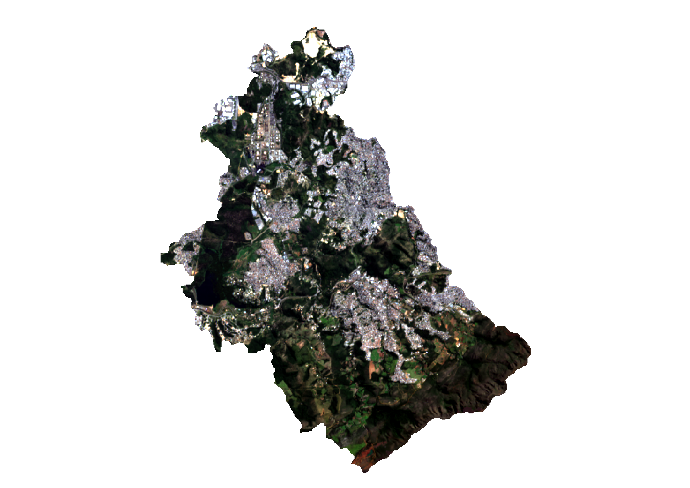
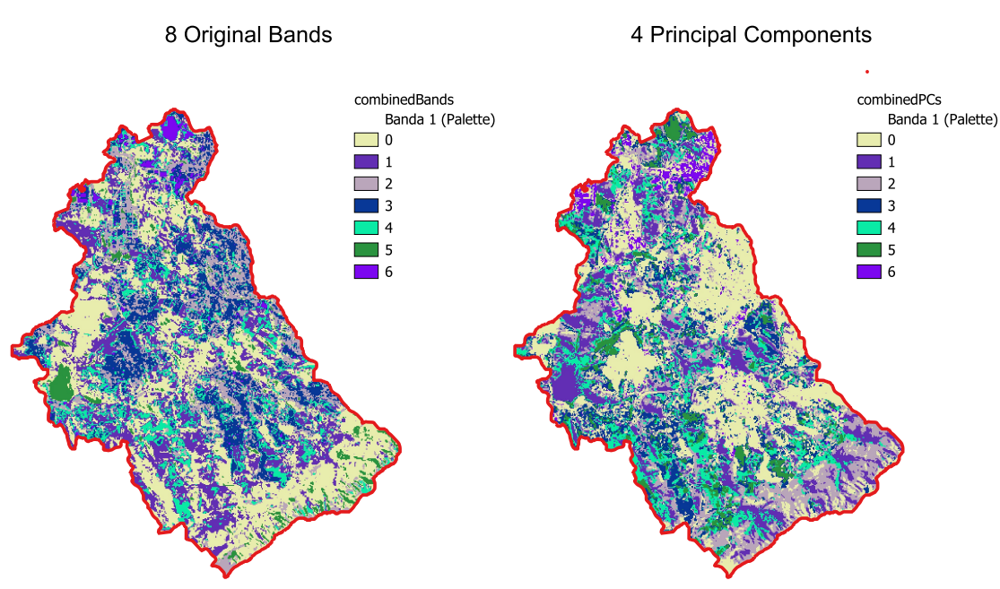

# RemoteSensingPCA 📡🌎

---
[📓 **Link para notebook interativo utilizado na apresentação**](https://drive.google.com/drive/folders/1BRmUqiSY7yHaFcD1vxPD4OaNHk4dtet-?usp=sharing)
---
**Processamento Numérico, PCA & Classificação K‑Means para Imagens Landsat 9**  
Projeto desenvolvido na disciplina **ALN – Algebra Linear Numérica** (2025/1) como estudo de caso de aplicação prática dos teoremas vistos em aula (Teoremas 1, 5 e 7 de Watkins) ao pipeline típico de Sensoriamento Remoto.

O objetivo é mostrar como operações matriciais transformam as bandas brutas do Landsat-9 em informações geoespaciais úteis, produzindo mapas temáticos claros e interpretáveis.

<div align="center">

</div>

---

## ✨ Principais Resultados

| Etapa | Saída gerada | Caminho |
|-------|--------------|---------|
| PCA (4 PCs) | `combinedPCs.tif` | `data/Results/` |
| Classificação K‑Means (6 clusters) | `classifiedCombinedPCs.tif` | `data/Results/` |
| Recorte por máscara (.shp) | `classifiedCombinedPCs_clip.tif` | `data/Results/` |
| Render colorido | `classifiedCombinedPCsFinal.png` | `data/Results/` |


A comparação logo abaixo confronta as oito bandas originais com as quatro componentes principais extraídas. Note como o PCA concentra a variância espectral, suaviza ruídos e revela padrões que se tornam mais nítidos na classificação K-Means subsequente, reduzindo a granularidade e destacando áreas urbanas e vegetação de forma mais clara.

<div align="center">

</div>
---

## 🎯 Objetivos

- Aplicar PCA em bandas espectrais de imagens Landsat/Sentinel.
- Realçar feições como vegetação, água e áreas urbanas.
- Implementar a PCA utilizando autovalores/autovetores sem bibliotecas de machine learning.
- Relacionar resultados visuais com a estrutura matemática por trás da transformação.

## 🧠 Fundamentação Teórica

A implementação está baseada em conceitos como:
- Matriz de covariância e decomposição espectral.
- Autovalores e autovetores (Capítulo 6 - Watkins).
- Espaços invariantes e subespaços associados à matriz de covariância.

| Conceito em aula | Implementação no código | Onde consultar |
|------------------|-------------------------|----------------|
| **Centralização** \(X ← X − μ\) | `pca.pca_svd(center=True)` | Tutorial PCA Satélite §2‑a |
| **Covariância** \(S = \frac{1}{N-1} X^{T} X\) | `pca.pca_svd` (linha 61) | Tutorial PCA Satélite §2‑b |
| **Decomposição em Valores Singulares** | `np.linalg.svd` (linha 77) | Aula ALN, slides DVS |
| **Relação σ² ↔ λ** | Pós‑processamento em `pca.pca_svd` | Watkins, Teoremas 1 & 5 |
| **Projeção em sub‑espaço PC** | `scores = X_c @ V[:,:k]` | Tutorial §3 |

## 🛠 Tecnologias e Dados Utilizados

- Python 3
- [Google Earth Engine] Imagens Landsat 9 (Bandas espectrais utilizadas: 1 a 9 (exceto a 8)

## 📊 Etapas

1. Leitura e empilhamento das bandas
2. Cálculo da matriz de covariância
3. Cálculo dos autovalores e autovetores
4. Projeção dos dados na nova base
5. Visualização dos componentes principais

## 🗂️ Estrutura do repositório

```text
.
├── config.bat                 # Atalho Windows: ativa venv + executa workflow
├── L9_L1_Ibirite_2022.js      # Script GEE para baixar bandas Landsat 9 L1
├── requirements.txt
├── src
│   ├── gis.py                 # Utilitários GIS (raster I/O, K‑Means, clipping…)
│   ├── pca.py                 # Implementação **própria** de PCA via SVD
│   └── main.py                # Orquestra o pipeline completo
└── data
    ├── Landsat Bands/         # Bandas GeoTIFF originais
    ├── SHP_Bacia/             # Máscara shapefile de recorte
```

## ⚙️ Instalação rápida
> Recomendado: **Python 3.10.x**
- Clone o projeto 
```git clone https://github.com/ChrystianMelo/RemoteSensingPCA.git```
- Para configurar o projeto basta executar o ```config.bat```
- Para executar o projeto basta executar o ```run.bat```

## 📖 Referências

- Watkins, D. *Fundamentals of Matrix Computations*, Wiley, 3rd Edition.
- [Projeto didático](Tutorial.pdf)
- Estornell et al., *Principal Component Analysis Applied to Remote Sensing* (2013)
